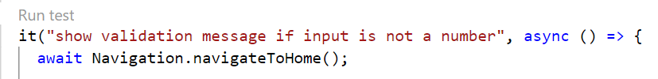

# Protractor test runner

Run a single protractor test (it) or a set of tests (describe).

## Extension Settings

This extension contributes the following settings:

* `run-protractor.protractorConfiguration`: Relative path (from workspace) to protractor config e.g. e2e/protractor.js.

## History
See changelog

## License
This software is released under [MIT License](http://www.opensource.org/licenses/mit-license.php)
